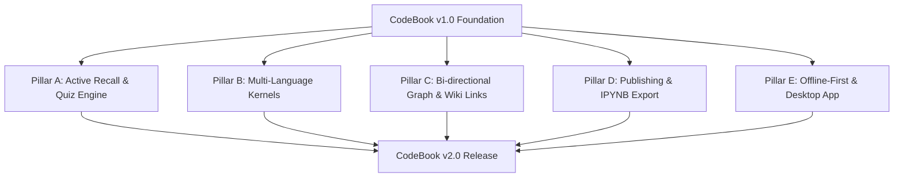

# CodeBook — Product Roadmap & Future Upgrades (v2.0+)

> **Product Vision:** CodeBook is a digital programming notebook first and an execution environment second. It is designed to help users learn programming concepts, write structured notes, practice code, and build a personal knowledge base they keep forever.

---

## 📌 Executive Summary

CodeBook **v1.0** successfully established the core foundation:
- Notion-style block editor combining Markdown text notes and Monaco Code blocks.
- Real-time Python 3.11 execution with support for 12+ data science & computer vision libraries (`numpy`, `pandas`, `matplotlib`, `polars`, `opencv`, `scipy`, etc.).
- Topic Tree workspace hierarchy (Notebooks → Topics → Pages).
- Session Workspace File Explorer for multi-file `.py` imports and data files (`.csv`, `.json`, `.png`, `.xlsx`).
- Supabase Auth & PostgreSQL persistence with Drizzle ORM.
- Minimalist, monochrome landing, about, and documentation experience.

This document outlines the **v2.0 and future milestone upgrades** to evolve CodeBook into the ultimate learning platform for software engineering and data science.

---

## 🗺️ Version 2.0 Roadmap & Milestone Pillars

---

### Pillar A: Active Recall & Learning Engine 🧠

Learning programming requires active practice, not just passive reading.

1. **Spaced Repetition (SRS) Flashcards:**
   - Convert any code snippet or note block into a review card with a single click.
   - Built-in SuperMemo SM-2 algorithm scheduling review sessions (`Today's Due Cards`).
2. **Interactive Exercise & Challenge Blocks (`ChallengeBlock`):**
   - Teachers or learners can create interactive coding exercises with hidden test assertions (e.g. `assert solution(5) == 25`).
   - Automated test feedback, hint reveals, and solution explanations.
3. **Progress Tracker & Mastery Dashboard:**
   - Visual progress bars per topic tracking retention rate, completed pages, and code execution count.

---

### Pillar B: Multi-Language & Multi-Kernel Expansion ⚡

While Python remains CodeBook's core foundation, expanding to web & database languages empowers full-stack learning.

1. **JavaScript & TypeScript Execution (Node.js Kernel):**
   - Execute JS/TS code blocks inside notebook pages with console stdout formatting.
2. **Browser-based SQL Engine (DuckDB / SQLite WebAssembly):**
   - Run interactive SQL queries against in-memory DuckDB or SQLite databases directly in the browser with interactive table views.
3. **HTML / CSS / SVG Live Preview Canvas:**
   - Visual block rendering for frontend web development notes.
4. **Pyodide Client-Side Execution (WebAssembly Fallback):**
   - Execute Python code directly inside the user's browser via WebAssembly for sub-10ms response times without server roundtrips.

---

### Pillar C: Bi-Directional Graph & Knowledge Architecture 🕸️

Transform flat notes into an interconnected personal knowledge graph.

1. **Wiki-Style Bi-Directional Links (`[[Page Name]]`):**
   - Type `[[` to reference any other notebook page or topic.
   - Automatic `Backlinks` section at the bottom of every page showing everywhere it is referenced.
2. **Interactive Knowledge Graph View:**
   - Visual 2D graph view displaying nodes (topics & pages) and connections (links & tags), allowing users to explore their learning network.
3. **Global Tagging System & Smart Collections:**
   - Tag pages with `#algorithms`, `#pandas`, `#recursion`.
   - Filter and query notes across notebooks by tags.

---

### Pillar D: Collaboration, Publishing & Export 📤

Knowledge is best retained when shared.

1. **Public Read-Only Page Publishing:**
   - Publish any notebook page to a clean public URL (e.g. `codebook.dev/p/deep/binary-search-trees`).
   - Clean, high-performance rendering formatted for mobile & desktop readers.
2. **Jupyter Notebook (`.ipynb`) Bi-Directional Converter:**
   - One-click import of `.ipynb` files directly into CodeBook structured pages.
   - Export any topic or notebook page to `.ipynb` format.
3. **PDF & Markdown Study Guide Generator:**
   - Export an entire notebook or topic as a single compiled PDF or Markdown document formatted for printing or offline study.

---

### Pillar E: Local-First Storage & Native Desktop App 📱

Provide seamless offline access and native desktop integration.

1. **Offline-First Synchronization (IndexedDB + PWA):**
   - Complete offline editing and execution support using Service Workers and IndexedDB. Automatically sync with Supabase when reconnected.
2. **CodeBook Desktop App (Tauri / Rust):**
   - Cross-platform desktop application for macOS, Windows, and Linux.
   - Native file system binding (`.cbk` notebook files) for local storage without cloud dependency.

---

## 📊 Feature Comparison & Target Experience

| Feature Area | CodeBook v1.0 (Current) | CodeBook v2.0 (Target) |
|---|---|---|
| **Primary Focus** | Python Notebook & Notes | Active Recall, Learning & Knowledge Graph |
| **Language Support** | Python 3.11 (FastAPI backend) | Python 3.11, Pyodide (Wasm), JS/TS, SQL |
| **Note Interconnection** | Topic Tree Hierarchy | Topic Tree + Bi-directional Wiki Links (`[[Page]]`) + Graph View |
| **Learning Tools** | Code Execution & Notes | Flashcards (SRS), Exercise Challenge Blocks, Progress Dashboard |
| **Data Persistence** | PostgreSQL (Drizzle) + Live REST | Offline-First (IndexedDB) + Cloud Sync + Local File Export |
| **Publishing** | Private Notebook Workspace | 1-Click Public URLs + IPYNB Export + Compiled PDF Study Guides |

---

## 🛠️ Technical Architecture Improvements for v2

1. **WebSocket Terminal Output Streaming:**
   - Upgrade execution API from HTTP polling to WebSockets for live stdout streaming during long-running loops (`for i in range(10): print(i)`).
2. **Redis Execution Cache:**
   - Cache deterministic code execution outputs on backend to minimize redundant container runs.
3. **Monaco Editor Custom Language Server Protocol (LSP):**
   - Auto-complete for custom user functions defined across earlier code blocks in the same page.

---

## 👨‍💻 Creator & Maintainer
- **Created & Architected by:** Deep Mhatre
- **GitHub:** [https://github.com/Deep-Mhatre](https://github.com/Deep-Mhatre)
- **LinkedIn:** [https://www.linkedin.com/in/deep-mhatre-021b832a9/](https://www.linkedin.com/in/deep-mhatre-021b832a9/)
- **Portfolio:** [https://deep-portfolio-eight.vercel.app/](https://deep-portfolio-eight.vercel.app/)
